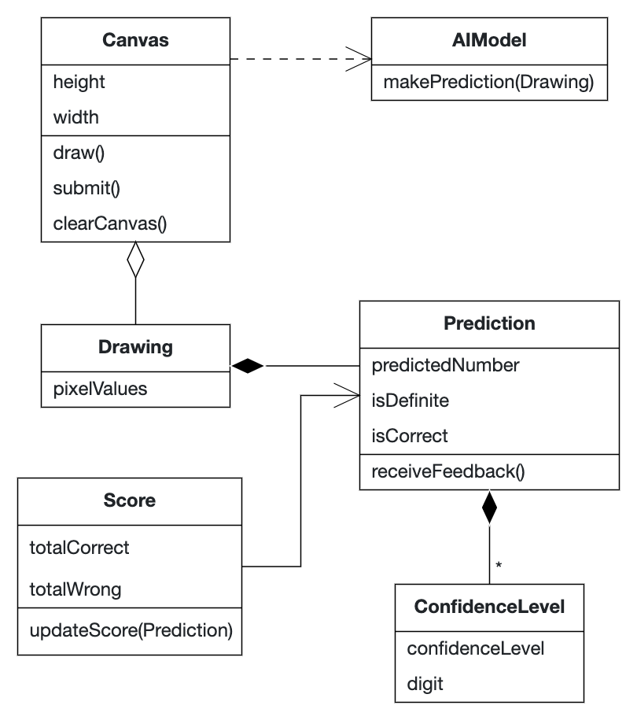
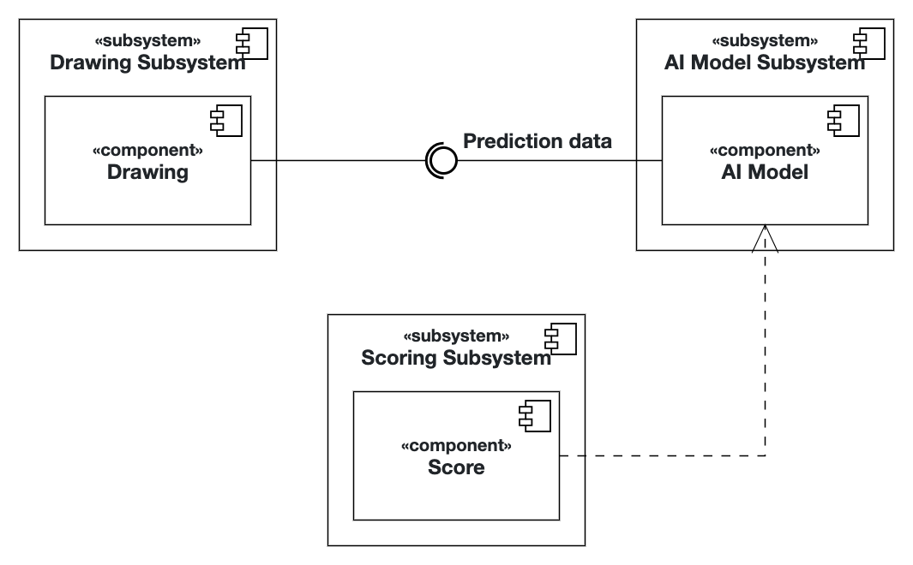

# Intro Course Project App of Sam Miao for the iPraktikum

To pass the intro course, you need to create your own unique iOS app (based on SwiftUI).

There are no requirements regarding the functions of your app, so you can get creative.
However, we provide you with Non-Functional Requirements (NFR) that your app needs to fulfill.

After each day of learning new Swift and SwiftUI concepts, these NFRs may change, or new NFRs get added.

## Submission procedure

You get a **personal repository** on Gitlab to work on your app.

Once you implemented a new feature into your app, you need to create a Merge Request (MR - Sometimes we will also reference these as "Pull Requests"(PR)) to merge your changes from the feature branch into your main branch.

Your tutor will review your changes and either request changes or approves the MR.

If your MR got approved, you also need to merge it!

### Deadline: **15.10.2024 23:59**

Until the deadline all of your PRs **need to be merged** and your final app **needs to fulfill** all of the requested NFRs!

---

## Problem Statement (max. 500 words)

As an elementary school teacher, I want to introduce young students to the capibilities of AI. For that I need an iOS app, where students can draw a digit and the app should guess the drawn number using an AI model trained on the MNIST dataset.

The user should be able to draw (a digit) on the provided canvas and also to submit the finished drawing. It should also be possible to clear the canvas, if the user made a mistake. The AI model should use a finished drawing to predict a confidence level for each digit for display if possible. If the prediction is clear, the app should show the predicted number. If the result is unclear, the user should be prompted to refine the drawing. Also, the app should include a user-friendly guide on how to use the app when starting it. 

Students should also be able to give feedback on whether a prediction was correct or wrong. After the feedback, the canvas should be cleared for the next drawing. As a bonus, it would also be nice if the user can keep track of the score of correct guesses so far.

## Requirements

Functional:
As a user, I want to be able to:
- click & read through a user guide when starting the app
- draw (a digit) on the canvas
- submit my finished drawing to the AI model by clicking a button
- see the predicted confidence level for each digit by the AI model and possibly the final number guess
- give feedback on whether the prediction was correct by clicking a dedicated 'Yes' or 'No' button
- clear the canvas (automatically after giving feedback)
- accumulate a score of correct predictions

Nonfunctional:
- User guide should be easy to understand for young students
- The AI model is trained on the MNIST dataset
- The AI model is located on a remote server
- When submitting a drawing, the prediction should take 10 seconds max

## Analysis

## System Design

## Product Backlog

// Don't forget to update it with each MR!

| ID           | Name                                       | Priority |
|--------------|--------------------------------------------|----------|
| BrAIniac-1   | Draw on canvas                             | CRITICAL |
| BrAIniac-2   | Submit drawing to AI model                 | CRITICAL |
| BrAIniac-3   | Display the AI model's prediction          | CRITICAL |
| BrAIniac-4   | Create user guide                          | MAJOR    |
| BrAIniac-5   | Give feedback on a prediction              | MAJOR    |
| BrAIniac-7   | Clear canvas                               | MAJOR    |
| BrAIniac-6   | Display confidence levels for each digit   | MINOR    |
| BrAIniac-8   | Accumulate correct prediction score        | MINOR    |
